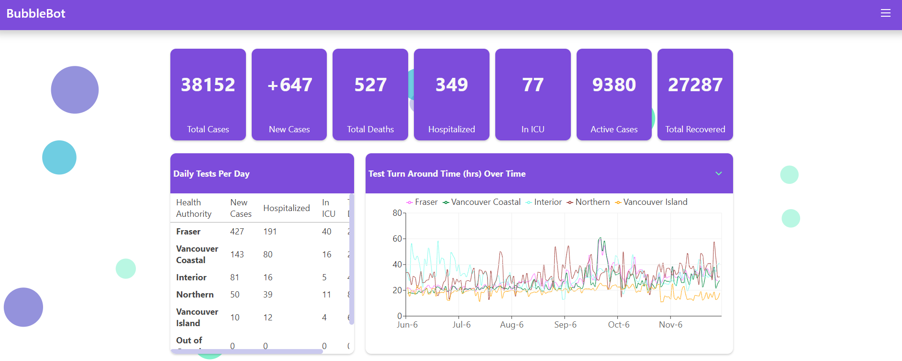
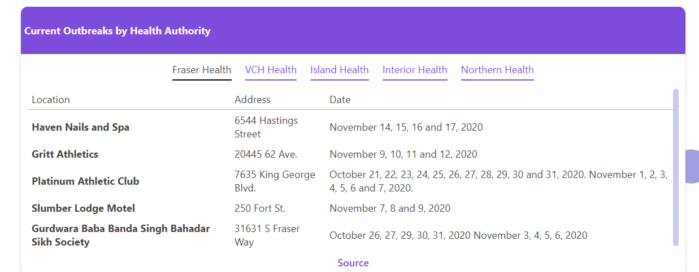

# CMPT 470 Project - Web Raccoons

### Objective

The objective of our project is to create bubble tracing and COVID-19 information chat interface, specifically for BC, Canada. 

The goal of our project, is for people to access Covid-19 data from a Facebook Messenger bot.

Four our final project, we implemented:

- A webapp Dashboard showing covid-19 statistics, and charts.



- & a web scraper service, receiving data from http://www.bccdc.ca/health-info/diseases-conditions/covid-19/data



- Chatbot (On Facebook Messenger) with features such as searching for outbreaks in different cities, or searching a whole health region boundary. A user can also get statistics such as, 
new cases, active cases, deaths, and overall cases in BC. A user can also search for statistics
filtered by each health region.

- accessible here: [FB Messenger Bot](m.me/117136746856965)


- The bot service needs to be reviewed by Facebook to be interactable with the public,
however, we can give testing privileges to TAs and Professor Chan after they make an
interaction with the bot. 

- Our database (caching new covid data, updating every hour)

- Docker and docker-compose for deployment

### Instructions

Run our GCP Instance (bubble-bot) & go to our dashboard website: http://bubble-bot.com

If the application fails to start after a minute, it can be restarted manually by doing the following:
```bash
cd /home/bubblebot
docker-compose up -d
```

