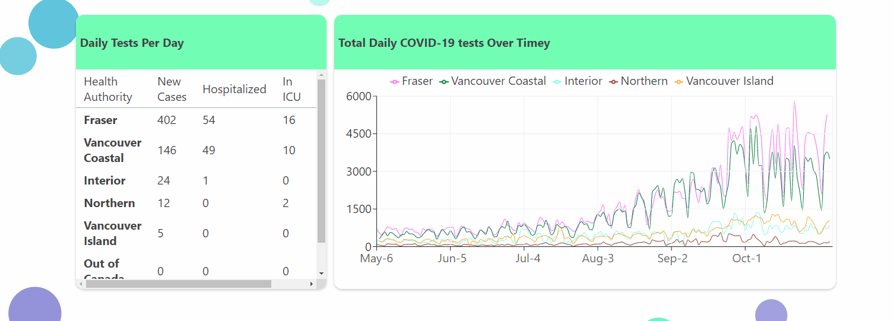
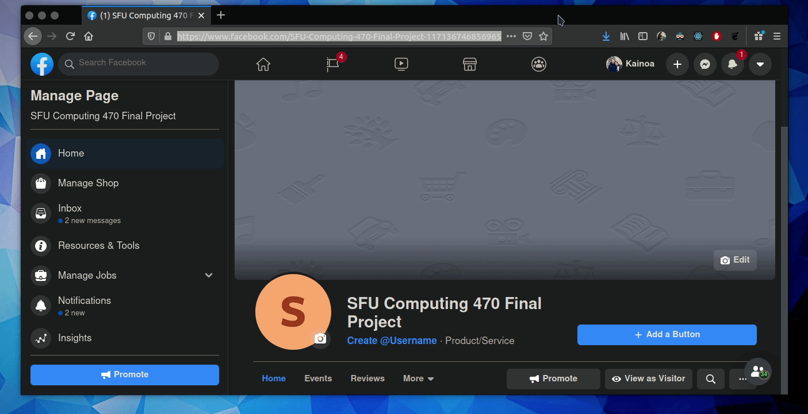
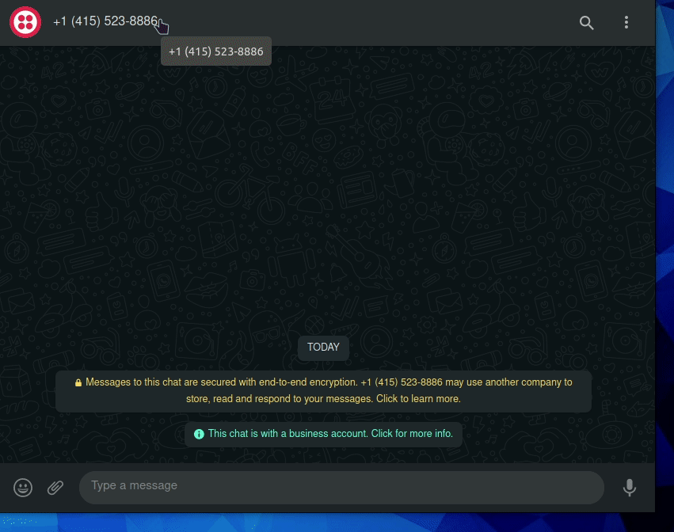

# CMPT 470 Project - Web Raccoons

### Objective

The objective of our project is to create bubble tracing and COVID-19 information chat interface, specifically for BC, Canada. 

The goal of our project, is for people to access Covid-19 data from chat apps, such as Whatsapp and Facebook Messenger, and through the dashboard on our webapp.

At the current interation (checkpoint) the following features are implemented:

- A webapp Dashboard & web scraper receiving data from http://www.bccdc.ca/health-info/diseases-conditions/covid-19/data

- Chatbot (On Facebook Messenger) responding to 'hi' (for testing), and 'data' (to show current & active cases) from https://www.facebook.com/SFU-Computing-470-Final-Project-117136746856965

- Chatbot (On Whatsapp/SMS) -- Difficult to test (See ./bot-controller/readme.txt for more info)

For our final iteration, we hope to implement:

- our database (storing loggin & user auth, covid data, user sessions)
- deployment of chatbots to user group chats
- bot logic to allow people to trace their contacts, give periodic reports, & message contacts if someone is covid positive

### Instructions

Run our GCP Instance (bubble-bot) & go to our static ip address: http://35.203.168.126/

### Notes

- our facebook bot webhook requires an SSL certificate to run on a production website (to be implemented)
